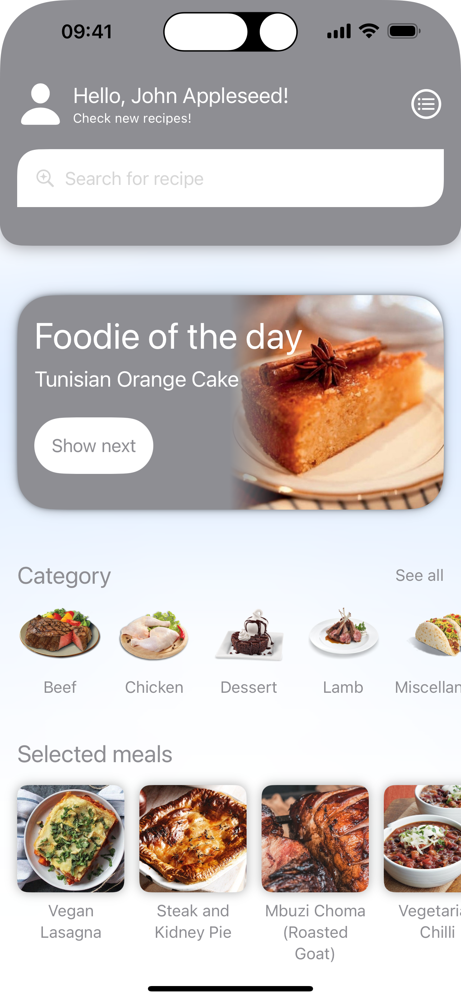
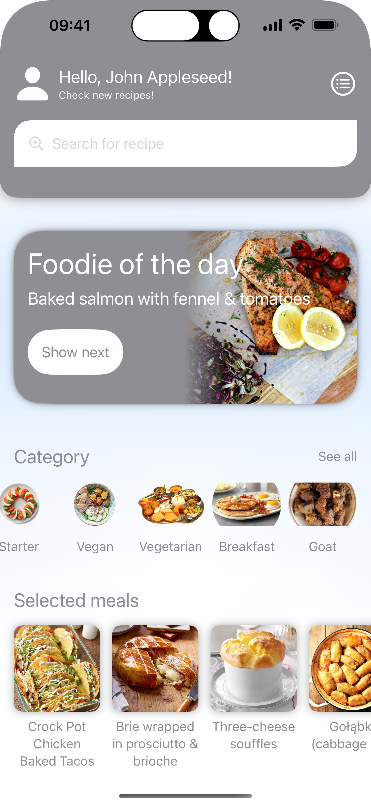
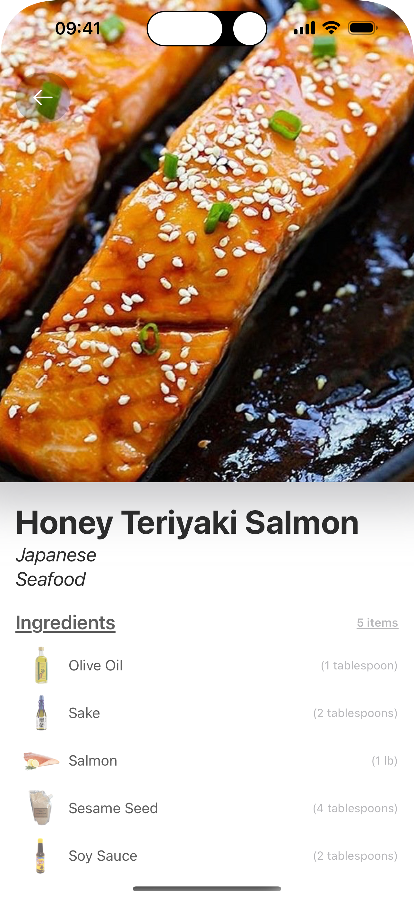
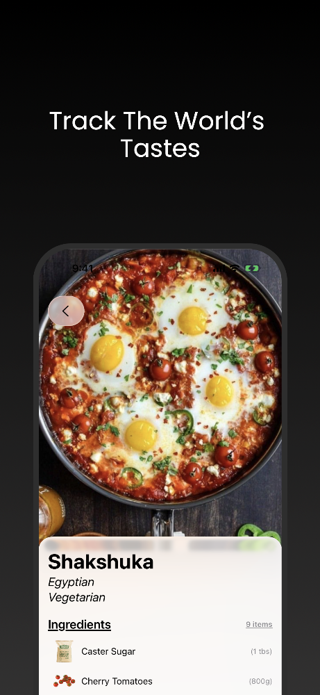
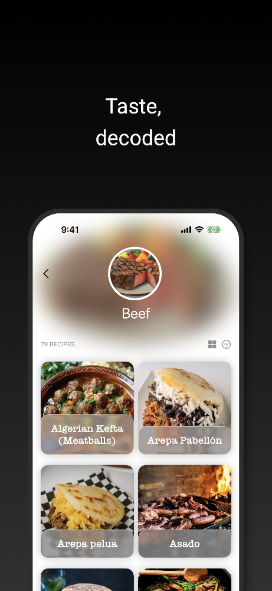

<h1 align="center">
Foodie
</h1>

Foods Catalogue

 

 

## TODO checklist

### Features:
- [ ] vibtarions
- [ ] iPad split screen
- [ ] Search bar

### Improvements:
- [ ] model
- [ ] async view states
- [ ] extract and clean text styles
- [ ] use EmbedInStackModifier
- [ ] localization
- [ ] check styles
- [ ] mocks + previews
- [ ] services concurrency locks instead VMs
- [ ] extract mapppers
- [ ] rename protocols segragation naming
- [ ] //TODO: #font
- [ ] mocked container target improvements
- [ ] DependencyContainerType & DI cleanup
- [ ] CoreData stubs
 
### Ideas
- [ ] DTO approach?
- [ ] service as Actor?
- [ ] dependency container library
- [ ] identifiableObject
- [ ] create some packages 

### Fixes:
- [ ] MotionManager handling and optimization (utilize core)
- [ ] iterate over TODO's
- [ ] remove routers ? RouterProtocol
- [ ] factories: remove doubled services 
- [ ] fix searchable

### Before release

### Done:
- [x] #Preview macro migration
- [x] create new target for mocked container &else
- [X] rename MealsServiceVMock into  MealsAsyncService ?
- [x] rename ViewBuilderProtocol into TheViewBuilder
- [X] rename MealsClosureServiceTypeNew
- [X] rename MealsServiceType
- [X] rename MealsServiceAsync into MealsAsyncService
- [X] rename MealsServiceVIType into MealsAsyncCombinedServiceType
- [X] rename MealsServiceStream into MealsAsyncStreamService
- [x] dependency container
- [x] iterate over TODO's
- [X] Realm
- [X] categories grid view
- [x] navigationBarHiddenx ?

### API

Used API: [themealdb](https://www.themealdb.com/api.php)
