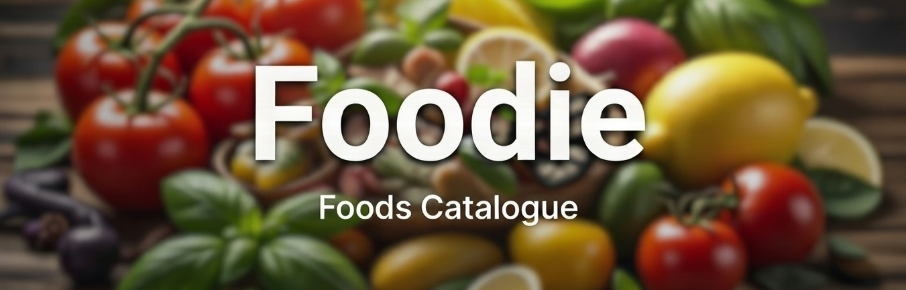

<p align="center">

</p>

# Foodie

[](https://developer.apple.com/ios/)
[](https://swift.org)
[](https://swift.org/package-manager/)
 [](https://developer.apple.com/xcode/)

<p align="center">
A food catalogue iOS application built with SwiftUI
</p>

<p align="center">

 
</p>
<p align="center">
 


</p>

## About The Project

Foodie is an iOS application that allows users to browse a catalogue of meals. Built using modern SwiftUI best practices, it demonstrates a clean, scalable, and maintainable architecture.

The project has been migrated to Swift 6. This ensures the codebase stays aligned with the latest Swift language features while benefiting from improved concurrency safety, making the app more robust and reliable.

Foodie also showcases multiple approaches to asynchronous programming in Swift. The project intentionally includes parallel implementations of services and view models that can be easily swapped via a dependency container, allowing developers to compare different concurrency models in practice. Dependency management follows SOLID principles and clean code guidelines, making Foodie a practical reference for modern iOS architecture and async design patterns.

From a UI architecture perspective, Foodie focuses on clear and maintainable view composition. Visual styling and decoration are encapsulated in reusable SwiftUI view modifiers, while UI components are extracted into dedicated view structures. This keeps views small and expressive, promotes consistent styling, and improves reusability and testability across the presentation layer.


### Features

*   Browse meal categories
*   View meal details
*   Asynchronous image loading
*   Parallax scrolling effects
*   Custom navigation bar animation during scrolling

## Technical Stack & Architecture

*   **UI:** SwiftUI
*   **Architecture:** Clean Architecture with an MVVM-like presentation layer
*   **Navigation:** Custom Router implementation
*   **Dependency Injection:** Custom dependency container
*   **Networking:** URLSession with async/await
*   **Persistence:** CoreData, Realm, and Swift Data explorations (as seen in `foodieTests/Persistence`)
*   **Testing:** XCTest/Testing API for unit and UI tests, with extensive mocking
*   **Automation:** Fastlane for automating builds, tests, and screenshots
*   **Logging:** Custom local Swift Package for logging

## Getting Started

### Prerequisites

*   Xcode 16 or later (Swift 6)
*   An Apple Developer account might be required for certain features

### Installation

1. Clone the repository:
   ```sh
   git clone https://github.com/groschang/foodie.git
   ```
2. Navigate to the project directory:
   ```sh
   cd foodie
   ```
3. Install Ruby dependencies:
   ```sh
   bundle install
   ```
4. Open the project in Xcode:
   ```sh
   open foodie.xcodeproj
   ```

## Running Tests

You can run tests via Xcode's Test navigator or by using Fastlane:

```sh
fastlane tests
```

## API

This project uses the [TheMealDB API](https://www.themealdb.com/api.php) to fetch meal data.

## Project Structure

```
foodie/
├── foodie/                  # Main app target
│   ├── App/                 # App entry point and main components
│   ├── Commons/             # Shared utilities and extensions
│   ├── Extensions/          # SwiftUI extensions
│   ├── Models/              # Data models
│   ├── Networking/          # API clients and networking
│   ├── Styles/              # Custom styles and view modifiers
│   └── utils/               # Low-level utility functions
├── foodieTests/             # Unit tests
├── foodieUITests/           # UI tests
├── Packages/                # Local Swift packages
├── Previews/                # Preview providers
├── fastlane/                # Automation scripts
└── Assets/                  # Images and media assets
```

## Architecture

Foodie implements a Clean Architecture pattern with a MVVM-like presentation layer, designed to follow SOLID principles and promote modularity, maintainability, and testability. The architecture is built around several key components and patterns:

### Layer Structure

1. **View Layer**: SwiftUI views that observe ViewModels and utilize reusable view modifiers for consistent styling
2. **ViewModel Layer**: Business logic and state management using Observer pattern with clear separation of concerns
3. **Service Layer**: Data fetching and persistence with multiple concurrent implementations (async/await, async streams, Combine)
4. **Model Layer**: Data models and entities with Codable support and persistence protocols
5. **Infrastructure Layer**: Networking, persistence clients, and utility functions

### Key Architectural Components

#### Dependency Injection Container
The project utilizes a sophisticated actor-based dependency injection container that supports:
- Selection between different persistence backends (CoreData, Realm, SwiftData) via compiler directives
- Asynchronous services with proper thread safety
- Centralized service registration and lifecycle management
- Mock container for testing purposes

#### Navigation System
Navigation is managed through a custom Router implementation that:
- Works seamlessly with SwiftUI's NavigationStack
- Supports deep linking via URL schemes
- Provides programmatic navigation controls
- Integrates with the view factory pattern for dynamic view creation

#### Service Abstractions
The project implements multiple services showcasing different async approaches, i.e.:
- **MealsAsyncService**: Traditional async/await implementation using actors for thread safety
- **MealsAsyncStreamService**: Async sequence/stream implementation
- **MealsCombineService**: Combine-based reactive implementation
- **MealsClosureService**: Closure-based callback implementation

#### View Factory Pattern
Dynamic view creation is handled through:
- Protocol-based view factories (AsyncViewFactory, StreamViewFactory, etc.)
- Route-driven view instantiation
- Consistent view composition patterns across the app

#### Data Persistence Strategy
Multiple persistence solutions are supported:
- **SwiftData**: Default option for iOS 17+ with modern Swift persistence
- **CoreData**: Traditional Apple persistence framework
- **Realm**: Third-party solution for flexible schema handling
- Compile-time selection via preprocessor directives (#if COREDATA, #if REALM, etc.)

#### Concurrency & Threading
The architecture emphasizes Swift 6 concurrency safety with:
- Actor-isolated services to prevent data races
- @MainActor annotations for UI updates
- Proper async/await patterns throughout
- Thread-safe dependency injection

### UI Architecture

#### View Composition
- Reusable view modifiers for consistent styling
- Dedicated styling layer with AppTheme and style protocols
- Separation of layout and presentation logic
- Placeholder and loading state management

#### State Management
- ObservableObject for view models
- Published properties for reactive updates
- Loading states and error handling
- Caching strategies for network requests

### Design Principles

- **Separation of Concerns**: Each component has well-defined responsibilities
- **Testability**: Extensive protocol usage enables comprehensive mocking
- **Flexibility**: Multiple implementation patterns allow for comparison and adaptation
- **Scalability**: Modular design supports feature growth
- **Modern Swift Practices**: Full Swift 6 compatibility with emphasis on concurrency safety
- **Protocol-Oriented Design**: Interfaces defined through protocols for loose coupling
- **Compiler-Directed Architecture**: Different behaviors selectable at compile time

## Contributing

1. Fork the repository
2. Create a feature branch (`git checkout -b feature/AmazingFeature`)
3. Commit your changes (`git commit -m 'Add some AmazingFeature'`)
4. Push to the branch (`git push origin feature/AmazingFeature`)
5. Open a pull request

## Who This Project Is For

Foodie is designed as a reference project for iOS developers interested in:
- Modern SwiftUI architecture
- Swift 6 concurrency and async patterns
- Dependency injection and clean architecture
- Scalable view composition and styling
  
## Roadmap

### Completed
- [x] Swift 6 migration
- [x] Migrate tests to Testing API
- [x] #Preview macro migration
- [x] Create new target for mocked container
- [x] Rename MealsServiceVMock into MealsAsyncService
- [x] Rename ViewBuilderProtocol into TheViewBuilder
- [x] Rename MealsClosureServiceTypeNew
- [x] Rename MealsServiceType
- [x] Rename MealsServiceAsync into MealsAsyncService
- [x] Rename MealsServiceVIType into MealsAsyncCombinedServiceType
- [x] Rename MealsServiceStream into MealsAsyncStreamService
- [x] Dependency container
- [x] Iterate over TODOs
- [x] Realm
- [x] Categories grid view
- [x] Navigation bar improvements
- [x] Model enhancements
- [x] Async view states
- [x] Service as Actor
- [x] IdentifiableObject
- [x] Mocks + previews
- [x] Extract mappers
- [x] Use EmbedInStackModifier

### Features
- [ ] implement haptic feedback
- [ ] implement iPad split screen
- [ ] implement search bar!

### Improvements
- [ ] Extract and clean text styles
- [ ] Font improvements
- [ ] Localization
- [ ] Check styles
- [ ] Mocked container target improvements
- [ ] DependencyContainerType & DI cleanup
- [ ] CoreData stubs
 
### Ideas
- [ ] DTO model approach
- [ ] Dependency container library
- [ ] Extract more additional packages

### Fixes
- [ ] MotionManager handling and optimization (utilize core)
- [ ] Iterate over TODO annotations
- [ ] Remove routers / RouterProtocol
- [ ] Implement searchable